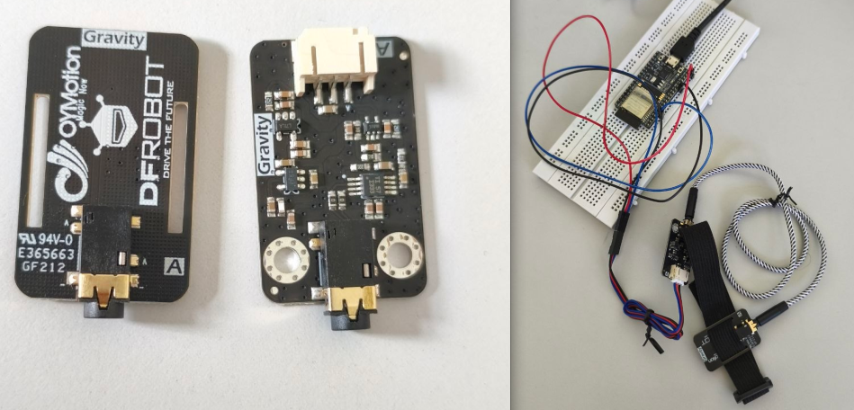
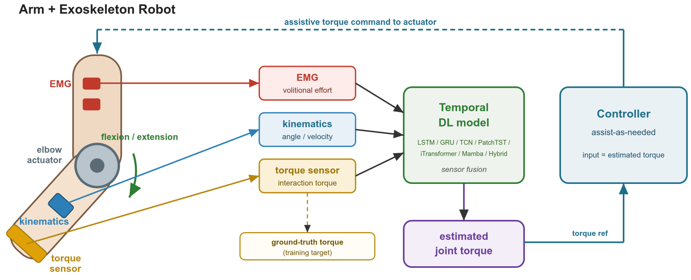
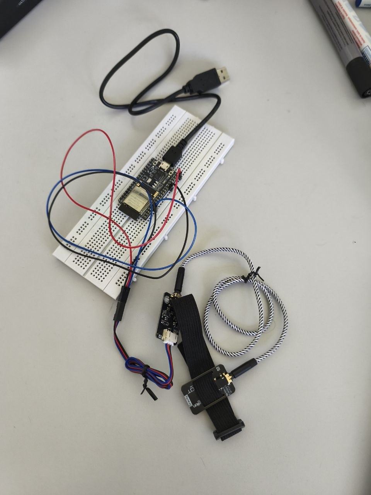
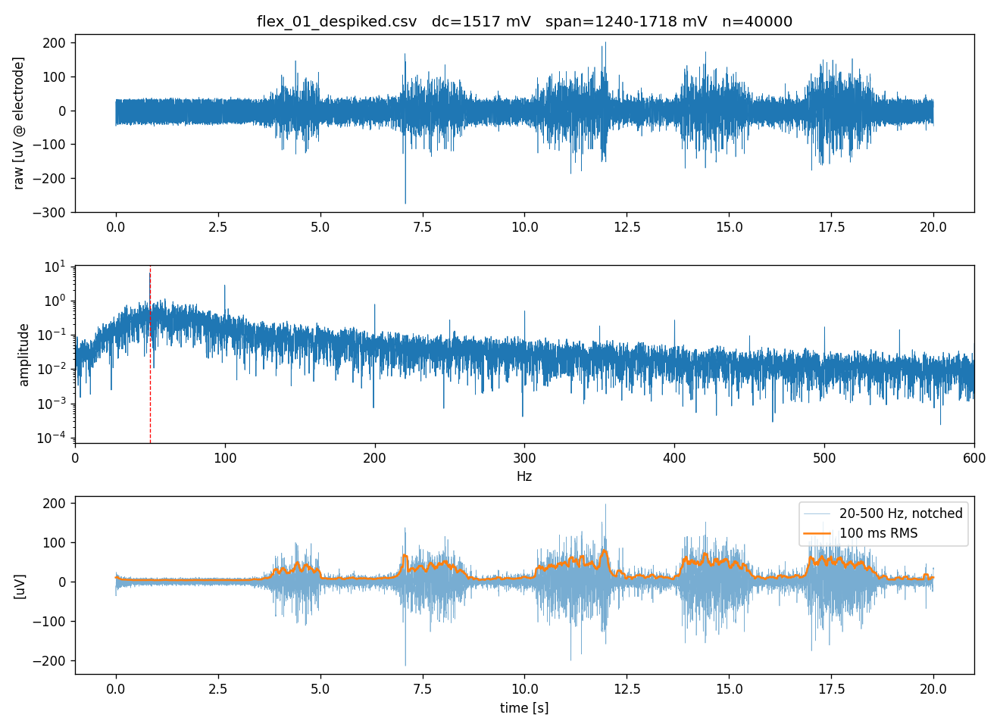
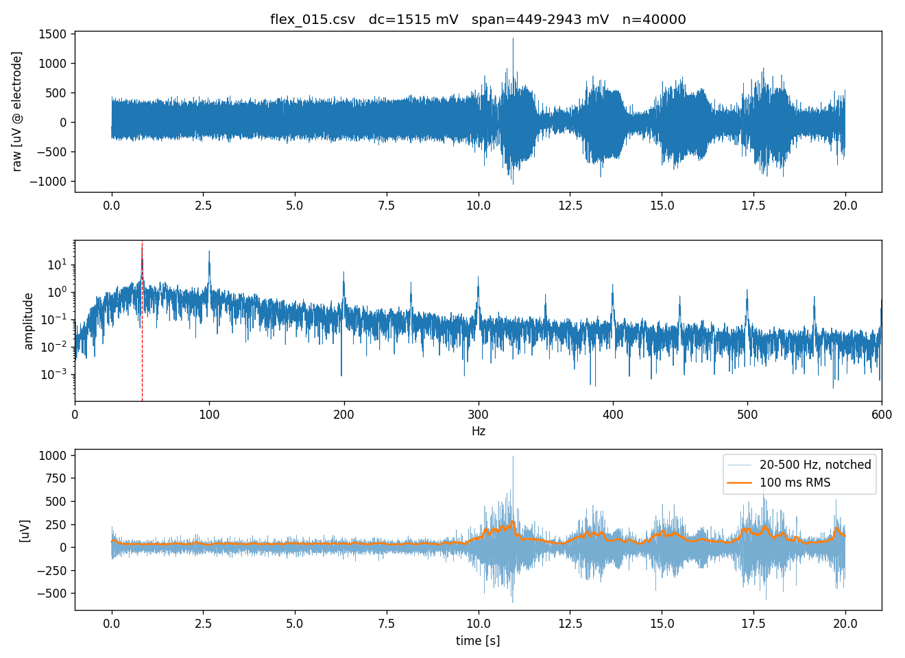

# Robotic Assist-as-Needed Control of an Upper-Limb Rehabilitation Exoskeleton, EMG-Based Torque Estimation with Temporal Deep Learning


#### ***Licensed under the GNU Affero General Public License v3.0 or later. See [LICENSE](LICENSE). Copyright (c) 2026 Javadian. All rights reserved.***

### Public Source Code

Source code is not published yet.     A paper based on this work "Cross-Subject Generalisation of Deep EMG-to-Torque Models for Upper-Limb Exoskeleton Control: Evaluation Leakage, Architecture Indifference, and Two-Parameter Calibration," is in preparation for ICORR 2027, Lausanne, Switzerland,  May 31-June 4, 2027., and the implementation will be released once it is out.
This repository currently documents the method, the evaluation protocol, and the results, the implementation currently lives in a private repository at [git-ce.rwth-aachen.de/javadian/emg-lstm](https://git-ce.rwth-aachen.de/javadian/emg-lstm). For questions, data access, or collaboration, please contact the repository owner through GitHub.  

---

## Project

Type: `Semester seminar project`  
Department: `Chair of Medical Information Technology (MedIT)`, `RWTH Aachen`.  
Supervisors: `Prof. Walter`, `Forouzan Salehi`.  
Dataset: `Exoskeleton lab, Helmholtz-Institute for Biomedical Engineering at RWTH Aachen University.`  

---
---

## Motivation

The clinical target is assist-as-needed torque support for stroke and neuromuscular rehabilitation. The device must estimate the user's intended joint torque from EMG, in real time, for a patient it has never seen.

That last constraint is the whole problem. Within-subject EMG-to-torque estimation is well established and reported at correlations above 0.97. Cross-subject estimation, where a model trained on other people is applied to a new user, is the recognized open question, and it is what determines whether such a device can be deployed without a per-patient data collection session. Activation patterns, electrode placement, limb geometry and normalization all differ between individuals.

The objectives are to determine whether the estimator generalizes under rigorous leakage-free evaluation, to identify the conditions under which it does and does not, to quantify the per-subject calibration effort needed for a new user, and to characterize how far architecture choice affects any of it.

EMG sensor setup:

---
## Introduction
Cross-subject deep learning for joint torque estimation from surface electromyography, developed as the sensing front end of an EMG-driven assist-as-needed controller for an upper-limb rehabilitation exoskeleton.

Seven neural architectures spanning four model families, evaluated on two public datasets with deliberately opposite structure, under three evaluation protocols of increasing rigor, with per-subject calibration, EMG-kinematics sensor fusion, and a second regression target at the shoulder.




EMG and, in the fusion configuration, joint kinematics feed the learned torque estimator, whose causal output becomes the assistive target for the controller. The torque sensor supplies the training target only and is not a model input at inference time.


---

## Headline results

Leave-one-subject-out cross-validation, 17 subjects, dynamic dataset, single-joint elbow flexion torque, EMG input only.

| Model | Family | LOSO R2 | RMSE (N m) | PCC |
|---|---|---:|---:|---:|
| iTransformer | attention over channels | 0.886 ± 0.049 | 2.23 | 0.963 |
| TCN to iTransformer | hybrid | 0.863 ± 0.122 | 2.31 | 0.966 |
| PatchTST | attention over time | 0.844 ± 0.090 | 2.55 | 0.963 |
| GRU | recurrent | 0.818 ± 0.214 | 2.54 | 0.964 |
| Mamba | selective state space | 0.813 ± 0.296 | 2.49 | 0.968 |
| TCN | causal convolutional | 0.808 ± 0.341 | 2.44 | 0.970 |
| LSTM | recurrent | 0.801 ± 0.221 | 2.64 | 0.963 |

Best deployable configuration, causal TCN with EMG plus joint kinematics: **R2 = 0.943, RMSE 1.51 N m**, strictly causal, no look-ahead.

Effect of per-subject calibration on the cross-subject gap:

| Condition | Cross-subject R2 | Between-subject SD |
|---|---:|---:|
| zero-shot, no calibration | 0.80 | 0.33 |
| affine, 2 parameters from 2 trials | 0.94 | 0.02 |
| full fine-tuning | 0.97 | 0.02 |

### Effect of the evaluation split

All entries LSTM. The same pattern holds for every architecture tested.

| Split | Published (isometric) | Isometric, this work | Published (dynamic) | Dynamic, this work |
|---|---|---|---|---|
| sequence (leaky) | PCC 0.99 | R2 0.95 / PCC 0.98 | not reported | R2 0.98 / PCC 0.99 |
| recording (within-subject) | not reported | R2 < 0 / PCC 0.20 | PCC 0.98 | R2 0.97 / PCC 0.99 |
| LOSO (cross-subject) | not reported | R2 < 0 | not reported | R2 0.80 / PCC 0.96 |

The isometric column collapses entirely once windows from one recording can no longer appear in both train and test. The dynamic column holds. Cross-subject is the row nobody in this literature reports, and it is the subject of this project.

### Where the gains actually came from

| Source | Gain in R2 |
|---|---:|
| per-subject calibration, zero-shot to affine | +0.14 |
| kinematic fusion, EMG to EMG plus angle and velocity (TCN, SJ) | +0.135 |
| architecture, worst to best across all seven | +0.085 |

Two of the three exceed the entire spread across four model families. This is the practical consequence of the architecture finding: effort belongs in calibration and sensing, not in model search.

---

## Comparison with published work

| Source | Model | Split | Result |
|---|---|---|---|
| Quesada 2026 | NLMap | within-subject | R 0.971 (SJ elbow) |
| Hoang 2026 | LSTM | within-subject | R 0.981 |
| This work | LSTM | recording (within-subject) | R 0.986 |
| This work | LSTM | LOSO (cross-subject) | R 0.963, R2 0.801 |
| This work | LSTM, affine calibration | LOSO (cross-subject) | R2 0.94 |

Rows two and three are the same architecture on the same data from two independent groups, and they agree to within 0.005. That fixes the pipeline against published work before any cross-subject claim rests on it. Row four is the condition no published work on this dataset reports.

The headline comparison, 0.80 cross-subject here against 0.97 published, is not like-for-like. The published figure is within-subject and calibrated on that person's own data. The within-subject figure here is also 0.97. After a calibration procedure requiring two trials, the cross-subject figure is 0.94. On a like-for-like basis the results match, and this work additionally quantifies what a genuinely new user costs.

### What the reference models are

The dataset's originating group evaluates four estimators. Their taxonomy is useful context for what a deep model is being compared against.

| Model | Definition | Fitting cost |
|---|---|---|
| MVLR | Weighted sum of the 12 muscle signals, least squares | Seconds |
| SYN | Factorize EMG into synergies, then linear map. Algebraically a rank-restricted MVLR | Seconds |
| NMS | Full Hill-type muscle model in a scaled OpenSim skeleton, 5 parameters per muscle by genetic algorithm | 20 to 60 min per subject |
| NLMap | Keep only the per-muscle saturating nonlinearity from NMS, discard skeletal geometry, then linear map. 1 parameter per muscle | Under 1 min |

NLMap wins in their evaluation. NMS, the physiologically principled option, does not beat plain linear regression in the multi-joint condition. Their conclusion is that a cheap nonlinearity captures most of what an expensive biomechanical simulation buys, which is a compatible finding to the architecture result reported here.

---

## What this project establishes

**1. Published-style sequence splits leak, and the leak costs roughly one full unit of R2.** Pooling overlapping sliding windows and splitting them at random puts windows from the same recording into both train and test. On the isometric dataset this yields R2 = 0.950 under the leaky split and R2 = -0.400 under a leakage-free recording split, with correlation falling from 0.975 to 0.197. A stratified split guaranteeing full task coverage does not recover it, which narrows the diagnosis to effort-level extrapolation specifically.

**2. The collapse is a property of the data, not of recurrent models.** A causal TCN pushed through the identical pipeline collapses on both leakage-free splits (R2 = -0.15 and -0.11). The mechanism is visible in one number: per-trial torque standard deviation is approximately zero by construction in the isometric dataset and 8.9 to 11.3 N m in the dynamic one. Discrete constant-effort recordings supply too few distinct torque values per subject for continuous regression, and any model degenerates into recognizing a finite set of conditions rather than estimating a continuous quantity.

**3. Architecture is not the bottleneck on data that does support the mapping.** On the dynamic dataset, seven architectures spanning recurrent, causal convolutional, time attention, channel attention, hybrid, and state-space families fall inside a 0.085 R2 band. The between-subject standard deviation within a single model ranges from 0.049 to 0.341, so which subject is held out moves the result more than which model is used. Three of the seven were published in 2023 to 2024 and represent current practice in multivariate time-series modeling, which makes the flat result informative rather than a sign of an under-explored search space.

Two independent arguments explain it. Physiologically, the EMG-to-torque relationship is dominated by the electromechanical delay, roughly 50 to 150 ms, which at 100 Hz is 5 to 15 samples, an order of magnitude shorter than the 200-sample window every model already covers. None of these models is memory-limited, so none can gain from having more memory. Information-theoretically, EMG is a noise-like carrier amplitude-modulated by effort, and recovering the envelope is a power-estimation problem whose variance is bounded below by the number of independent samples inside the signal's correlation time. That bound is a property of the signal, not of the estimator. Once a model's receptive field covers the correlation time it sits at the floor, and no architecture crosses a floor.

With one model, "architecture does not matter" would be an assumption. With four families including a 2024 state-space model, it is a falsifiable claim that survived the test.

**4. The residual cross-subject gap is an amplitude mismatch, not a representation failure.** On subjects where the population model produces negative R2, Pearson correlation stays around 0.97. Subject S14 is the clearest case. High correlation paired with negative R2 is the specific signature of a gain and offset error rather than a failure to learn the shape of the relationship. This is an instance of a broader identifiability confound: per-subject gain and true torque amplitude enter the observation multiplicatively and cannot be separated from a single unlabeled recording.

**5. Two parameters close most of it.** A scale-and-offset affine correction, fitted on two trials of the held-out subject with test trials kept disjoint from calibration trials and normalization statistics drawn from the pretraining pool only, raises cross-subject R2 from 0.80 to 0.94 and collapses the between-subject standard deviation from 0.33 to 0.02. Full fine-tuning reaches 0.96 to 0.97 but needs per-user training. That two parameters are sufficient, and that more calibration data adds little beyond that, is the predicted consequence of the identifiability argument rather than an empirical accident: the worst-performing subject has a fitted scale near 0.5, meaning the population model over-predicts that subject by roughly a factor of two, and correcting that single gain term alone recovers R2 to about 0.95. The result is consistent across LSTM and TCN, which makes it a property of the data rather than of the model.

**6. The same calibration procedure fails on the isometric dataset**, moving R2 from about -0.47 to roughly zero regardless of calibration budget. It recovers correlation to about 0.66 but never real accuracy. Calibration needs continuous torque structure in the target signal to have something to adapt to; it does not help when the underlying regression problem is ill-posed for the data.

**7. The multi-joint condition costs about 0.20 R2 uniformly across all seven architectures.** Twelve muscles must explain two torques instead of one, and biarticular muscles span both joints, so the same activation pattern is consistent with several torque pairs. The uniformity of the drop identifies it as a limit of the sensor montage rather than of any one model.

**8. Shoulder elevation torque is estimable as a second target**, with median cross-subject R2 of 0.59 to 0.67 and a positive result on 14 to 16 of 17 subjects, extending the system from one degree of freedom to two. Per-model values are LSTM 0.589, TCN 0.660, GRU 0.670. The subjects where it fails are the same subjects showing the amplitude mismatch described above.

**9. EMG-kinematics fusion improves every configuration tested**, most sharply in the single-joint case (TCN 0.808 to 0.943), where joint angle determines muscle length and moment arm and therefore resolves a genuine physical ambiguity rather than adding redundant information. The required sensing, joint encoders and an IMU, is already present on the target hardware.

**10. Against the dataset's originating publication**, which evaluates only within-subject, these models match the reference single-joint correlation (0.96 to 0.97 versus 0.971) while generalizing across subjects, a strictly harder setting, and without requiring a force or torque sensor at calibration time. The within-subject recording-split result on the isometric dataset separately reproduces the most directly comparable published LSTM number (0.986 here versus 0.981 published), which validates the pipeline against the literature before any cross-subject claim is built on it.

---

## Datasets

Neither dataset is redistributed in this repository. Both are public.

| | Isometric | Dynamic |
|---|---|---|
| Role | reproduction target and methodological diagnostic | primary object of study |
| Participants | 12 healthy male, 28.3 ± 5.5 yr | 17 healthy (11 male), 28.2 ± 7 yr |
| Regime | isometric, held constant | continuous dynamic tracking against viscous load |
| Conditions | 4 tasks: flexion, extension, pronation, supination | single-joint (elbow), multi-joint (elbow and shoulder) |
| Effort structure | 3 discrete levels: 10, 30, 50 percent MVC | continuous, B-spline trajectories |
| Recordings | 144 (12 x 4 x 3), 10 s each | 340 (17 x 2 x 10), about 30 s each |
| EMG | 5 muscles, three 2D HD arrays, monopolar | 12 bipolar channels, SENIAM placement |
| EMG hardware | OT Bioelettronica EMG-USB, 2048 Hz, 10 to 750 Hz | Cometa MiniWave wireless, released at about 100 Hz |
| Conditioning | raw monopolar, all filtering done here | pre-filtered 20 to 450 Hz, rectified, 3 Hz envelope, MVC-normalized |
| Torque ground truth | two transducers at the brace, elbow axis, measured directly | ATI 1010 six-axis force/torque sensor at the wrist, joint torque by inverse dynamics |
| Per-trial torque SD | approximately 0 by construction | 8.9 to 11.3 N m (single-joint) |
| Kinematics | none, limb fixed | joint angle and velocity, OpenSim plus motion capture |
| Targets | elbow flexion/extension, pronation/supination | elbow flexion, shoulder elevation (multi-joint only) |
| Source | figshare | Zenodo, DOI 10.5281/zenodo.11209324 |

The decisive contrast is the per-trial torque standard deviation. The isometric dataset provides a small number of constant torque values per participant; the dynamic dataset varies torque continuously inside every trial. That difference alone determines whether a continuous EMG-to-torque mapping exists to be learned, and the two datasets produce opposite outcomes under identical leakage-free evaluation.

### Ground-truth torque

The two datasets obtain their labels by different measurement chains, which bounds what each label means.

**Isometric, measured directly.** Two OT Bioelettronica torque transducers, 150 N m range, mounted in the arm brace either side of the elbow with axes aligned to the elbow rotation axis, digitized on the same synchronized chain as the EMG at 2048 Hz and shown live to the subject as effort feedback. The two-transducer arrangement is what lets one fixture resolve four tasks: the flexion/extension component is proportional to the sum of the two transducer readings and the pronation/supination component to their difference. MVC is measured physically with the same transducers at session start, so 10, 30 and 50 percent are fractions of a measured maximum rather than perceived effort.

**Dynamic, reconstructed by inverse dynamics.** One ATI 1010 Digital FT six-axis force/torque sensor mounted between the forearm orthosis and a slider on the exoskeleton's forearm link. It measures the interaction wrench at the wrist, not joint torque. Joint torque follows from

```
tau_h = M(q) qddot + c(q, qdot) + g(q) + tau_i
tau_i = J(q)^T f_s + tau_s
```

where M, c and g come from the Holzbaur upper-extremity model scaled per subject in OpenSim from motion-capture anthropometrics. Kinematics come from 10 Oqus 500+ cameras with 8 markers on anatomical landmarks rather than from the exoskeleton encoders, specifically to avoid human-exoskeleton joint misalignment. Encoder and force streams are synchronized post hoc by minimizing RMSE between encoder-derived and camera-derived exoskeleton position.

---

## Method

### Preprocessing, isometric arm

Per recording: load monopolar `.bin` files (biceps, triceps, three-region forearm), filter each channel zero-phase with a 50 Hz notch, a 5 Hz high-pass and a 500 Hz low-pass. Build five per-muscle representative signals by averaging channels inside each anatomical region, with forearm channel ranges read from the dataset's own metadata and verified to partition the full channel set before processing continues. Slide a 100-sample window at step 1, extract 14 time-domain features per window per muscle for a 70-dimensional vector per time step. Average the two torque transducers, smooth, and align the target to the last sample of its window so no look-ahead exists.

Two departures from the reference publication are deliberate. Five per-muscle signals rather than three grid-averaged signals, because the forearm grid spans muscles that are functionally distinct and partly antagonistic across the four tasks, and averaging them destroys the activation differences that distinguish one task from another. No frequency-domain features at this window length, since at 2048 Hz a 100-sample FFT has roughly 20 Hz resolution and stable spectral estimation needs 200 to 400 ms windows.

### Preprocessing, dynamic arm

EMG arrives already conditioned and co-sampled with kinematics and torque at 100 Hz. Twelve channels are read directly, optionally with joint angle and angular velocity appended in a joint-set-aware manner, and windowed into 200-sample sequences, stride 100 during training and 200 at evaluation so evaluation windows never overlap.

### Architectures

All seven share one harness with matched training settings: Adam, learning rate 5e-3 with step decay, MSE loss, gradient clipping, early stopping on validation loss, sequence-to-sequence output at every time step.

- **LSTM, GRU.** Single layer, 128 hidden units.
- **TCN.** Dilated causal convolutions, receptive field 373 samples against a 200-sample window, strictly causal by construction and therefore real-time capable.
- **PatchTST.** Overlapping patches along time, self-attention over the patch sequence, channels processed independently through a shared encoder.
- **iTransformer.** Attention axis inverted so each EMG channel is a token whose embedding encodes that channel's entire window, modeling inter-muscle correlation directly. Structurally motivated here because EMG channels are co-activated by shared neural drive.
- **TCN to iTransformer hybrid.** Causal TCN front end supplies local temporal structure that channel attention alone cannot represent, feeding the channel-attention stage. Causality is preserved in the temporal path.
- **Mamba.** Selective state-space model with input-dependent transitions, causal by construction, with a fused CUDA kernel where available and a portable scan otherwise.

### Evaluation protocols

- **sequence.** All windows pooled and split at random. Leaks by construction; retained as an optimistic reference and as the mechanism under study.
- **recording.** Whole recordings or trials held out per subject; every subject still appears in training. Leakage-free at the trial level.
- **loso.** 15 train, 1 validation, 1 test subject, 17 folds. Leakage-free at the subject level and the realistic deployment condition.

A stratified variant on the isometric arm additionally isolates effort-level extrapolation by guaranteeing every subject's training set covers all four tasks.

Normalization statistics are computed from training data only throughout, and torque targets are always aligned to the last sample of their window.

### Metrics

R2, RMSE in newton-meters, and Pearson correlation. The separation between the R2 family and the correlation family is load-bearing: high correlation with low or negative R2 is the signature of an amplitude mismatch, which is what motivates the calibration analysis above.

---

## Current work: custom acquisition hardware

The results above come from two public datasets recorded on laboratory-grade equipment. Work in progress characterizes a low-cost acquisition rig built for this project, so that its signal properties can be compared against those datasets and the transferability of models trained on lab-grade data can be assessed directly.



| Item | Detail |
|---|---|
| Sensor | DFRobot SEN0240 Gravity Analog EMG, by OYMotion |
| Sensor output | 0 to 3.0 V, idle rail 1.5 V, gain approximately 1000, band 20 to 500 Hz |
| Boards | Conditioner board (PH2.0 connector, analog front end) and electrode board (three dry metal pads, strap slots), joined by a 3.5 mm male-male cable |
| MCU | Espressif ESP32-DevKitC-32E, ESP32-WROOM-32E, ESP32-D0WD-V3 rev 3.1 |
| Acquisition | GPIO34 (ADC1, input-only) at a hard 2 kHz, factory eFuse calibration applied on-chip, streamed as calibrated millivolts over USB serial |

Design decisions, all deliberate:

**No on-device signal processing.** The microcontroller samples, calibrates and transmits. No filtering, rectification or thresholding happens before the data reaches the host, so every processing step remains reversible and auditable offline. The ESP32 ADC transfer curve is markedly nonlinear, so calibrated millivolts rather than raw counts are recorded to avoid baking that distortion into every file permanently.

**The vendor's own filtering library was examined and deliberately not used.** Its coefficients were verified against `scipy.signal.butter` and several are correct, but the library supports only two sample rates and silently bypasses filtering at any other, its low-pass corner discards a large part of the muscle band this rig is meant to characterize, its filter state is held in file-scope globals so two sensor instances would interleave their histories, and one notch coefficient row contains a comma typo that silently distorts the passband for the exact configuration a European user at 50 Hz mains would select. None of these are defects for the library's intended purpose, which is real-time gesture detection on a microcontroller with no host attached. They are the wrong trade-offs for signal characterization.

**Sample timing is owned by the microcontroller.** Time is reconstructed from sample index rather than from host arrival timestamps, which are jittered by USB buffering and unusable as a time base. This matters because EMG will later need sample-level alignment with a force signal.

Characterization findings so far, from controlled tests rather than inference:

- Mains contamination in this rig is dominated by a conducted path through the ground network rather than by radiated pickup. Repeated toggling of a single environmental variable with everything else held fixed reproduced saturation and its absence deterministically, and physically relocating the board changed nothing.
- Contact impedance at the dry electrode is the controlling variable for signal quality. Skin preparation and settling time both have large, repeatable effects.
- The distinction that governs everything downstream is that interference is removable and saturation is not. When the amplifier is pinned at its rails the muscle signal at those samples was never recorded, and a notch filter applied to clipped data produces a smooth, plausible and entirely fabricated result.
- A despiking stage was implemented, tested against synthetic data with known injected artifacts, and then rejected. Surface EMG genuinely contains large fast excursions at this bandwidth, so heavy tails are not by themselves evidence of artifact, and applying the filter changed no measured signal property.

Example recordings, both biceps brachii, both 20 s:



A session with good electrode contact. The band-passed trace shows a low resting floor and the RMS envelope rises into distinct bumps matching each contraction. The spectrum shows the expected broad muscle hump with mains lines narrow enough to notch cleanly.



A later session with an unresolved problem. Peak amplitude is comparable but the resting floor is substantially higher, so the contrast between rest and contraction is much reduced. The mains fundamental is smaller while its harmonics are considerably larger, which indicates the interference became non-sinusoidal rather than simply stronger. Candidate causes have been enumerated but not yet separated by controlled test. This directly affects the amplitude-based features the models consume, so it is being resolved before any dataset collection begins.

Scope at this stage is characterization of a single sensor, not dataset collection. A second sensor, a load cell and joint torque measurement are planned and deliberately deferred. When torque pairs are needed, reading the load cell from the same microcontroller sidesteps the cross-device synchronization problem entirely.

Recording under movement rather than isometrically introduces effects absent from the current tests: motion artifact at the skin-electrode interface, triboelectric artifact from cable flexing, and geometric amplitude change as the muscle belly shortens and slides beneath a fixed electrode. That last effect makes a dynamic recording without simultaneous joint angle fundamentally unidentifiable, since an amplitude change cannot be attributed to effort rather than electrode geometry. This is a measurement design constraint rather than a signal quality problem, and it is the hardware counterpart of the fusion result reported above.

---

## Repository layout

```
.
├── README.md
├── LICENSE
├── .gitignore
│
├── dynamic_dataset/          Quesada dataset, primary study arm
│   ├── layers.py             TemporalBlock, shared causal residual block
│   ├── models_ext.py         iTransformer, PatchTST, hybrid, Mamba
│   ├── train.py              unified harness: 7 models, 3 splits, 2 conditions, 2 targets
│   ├── calibrate.py          zero-shot vs affine vs fine-tune calibration
│   └── snr_sweep.py          noise injection on raw 2 kHz EMG, then full refilter
│
├── isometric_dataset/        Rojas-Martinez dataset, reproduction and diagnostic arm
│   ├── layers.py             same module, kept local so each folder is self-contained
│   ├── preprocess.py         5-muscle time-domain feature extraction
│   ├── preprocess_fd.py      dual-window TD + FD ablation at a spectrally valid window
│   ├── check_features.py     pre-flight validation gate, non-zero exit on failure
│   ├── train.py              LSTM, GRU, causal TCN, 3 split protocols
│   ├── snr_sweep.py          model-agnostic noise-robustness sweep
│   ├── plot_predictions.py   scatter, residual, and time-series overlay figures
│   └── collect_results.py    aggregation to CSV and comparison figures
│
├── figures/
└── results/
    └── loso_7models.md       collected LOSO comparison across all seven architectures
```

Structure of the implementation as it will be released. See the status note above.

`layers.py` is intentionally duplicated in both folders rather than imported across a package boundary. The repository is two flat scripts-plus-shared-module directories, not an installable package, so each folder stays runnable on its own without a `sys.path` adjustment or an `__init__.py`.

---

## Environment

Python 3.11, PyTorch 2.6 with a CUDA 12.4 build, NumPy, SciPy, pandas. Mamba additionally requires `causal-conv1d` and `mamba-ssm` built against a matching CUDA toolkit; there is no Metal path, so on Apple Silicon it falls back to the portable scan in `models_ext.py`, which is correct but slow. All scripts read data and output paths from environment variables rather than hardcoding a machine-specific location.

The acquisition rig is separate: an ESP32 sketch built with `arduino-cli` and the esp32 core, and a host-side Python environment with NumPy, SciPy, matplotlib and pyserial.

---

## References

Datasets:

- Rojas-Martinez M. et al. (2020). High-density surface electromyography signals during isometric contractions of elbow muscles of healthy humans. *Scientific Data* 7:397. doi:10.1038/s41597-020-00717-6
- Quesada L. et al. (2024). A dataset for the investigation of upper limb torque prediction from EMG signals. *Zenodo*. doi:10.5281/zenodo.11209324

Reference methods reproduced or compared against:

- Shakeriaski F., Mohammadian M. (2025). Enhancing upper limb exoskeletons using sensor-based deep learning torque prediction and PID control. *Sensors* 25(11):3528.
- Quesada L. et al. (2026). EMG-to-torque models for exoskeleton assistance: a framework for the evaluation of in situ calibration. *IJRR*. doi:10.1177/02783649251414884
- Hoang D. et al. (2026). EMG-based torque prediction for assistive exoskeleton control using neural networks with bounded generalization error. HAL hal-05556797.
- Quesada L. et al. (2025). EMG feature extraction and muscle selection for continuous upper limb movement regression. *BSPC* 103:107323.

Architectures:

- Hochreiter S., Schmidhuber J. (1997). Long short-term memory. *Neural Computation* 9(8).
- Cho K. et al. (2014). Learning phrase representations using RNN encoder-decoder. *EMNLP*.
- Bai S., Kolter J.Z., Koltun V. (2018). An empirical evaluation of generic convolutional and recurrent networks for sequence modeling. arXiv:1803.01271.
- Nie Y. et al. (2023). A time series is worth 64 words. *ICLR*.
- Liu Y. et al. (2024). iTransformer: inverted transformers are effective for time series forecasting. *ICLR*.
- Gu A., Dao T. (2023). Mamba: linear-time sequence modeling with selective state spaces. arXiv:2312.00752.

Method grounding:

- Cavanagh P.R., Komi P.V. (1979). Electromechanical delay in human skeletal muscle. *Eur. J. Appl. Physiol.* 42(3).
- Potvin J.R., Brown S.H.M. (2004). Less is more: high pass filtering to remove up to 99% of the surface EMG signal power improves EMG-based biceps brachii muscle force estimates. *JEK* 14(3).
- Staudenmann D. et al. (2006, 2007). Improving EMG-based muscle force estimation using a high-density EMG grid and PCA.
- Phinyomark A., Phukpattaranont P., Limsakul C. (2012). Feature reduction and selection for EMG signal classification. *ESWA*.
- Sarker P., Mirka G. (2019). The effect of sampling frequency on the analysis of EMG median frequency. *HFES*.
- Hermens H.J. et al. (2000). Development of recommendations for SEMG sensors and sensor placement procedures. *JEK* 10(5).
- Hashemi J., Morin E., Mousavi P., Hashtrudi-Zaad K. (2014). Enhanced dynamic EMG-force estimation through calibration and PCI modeling. *IEEE TNSRE*.
- Holzbaur K. et al. (2005). A model of the upper extremity for simulating musculoskeletal surgery and analyzing neuromuscular control. *Ann. Biomed. Eng.* 33(6).
- Seth A. et al. (2018). OpenSim: simulating musculoskeletal dynamics and neuromuscular control. *PLoS Comput. Biol.* 14(7).
- Hajian G., Morin E., Etemad A. (2022). Multimodal estimation of endpoint force during quasi-dynamic and dynamic muscle contractions using deep learning. *IEEE TIM* 71:2513111.
- Hajian G. et al. (2024). Generalizing upper limb force modeling with transfer learning. *IEEE TNSRE* 32.
- Xiong D. et al. (2021). Deep learning for EMG-based human-machine interaction: a review. *IEEE/CAA JAS* 8(3).

---

## Status and outlook

Offline study complete across both datasets, all seven architectures, both conditions, both targets, EMG-only and fused inputs, and the full calibration comparison. All results are on healthy participants; the calibrated cross-subject accuracy reported here is a healthy-subject ceiling, and clinical populations with altered activation patterns require separate validation before the same figures can be claimed for a rehabilitation setting.

In progress: characterization of the custom acquisition rig described above, ahead of collecting a dataset on our own device and hardware.

Next: deployment on the physical exoskeleton with patients, and quantifying the accuracy lost when the device's onboard IMU and encoders replace laboratory motion capture as the kinematic input. The fusion result above establishes the value of that input under ideal measurement; the open question is how much of it survives realistic sensing.

Two properties established here carry directly into on-device design. The identifiability analysis implies a brief known-amplitude calibration burst at the start of a session is the correct hedge against session-to-session gain drift, at negligible cost. The information-theoretic floor implies the estimator's window should be sized to the torque correlation time and no longer, since accuracy past that point is limited by the signal rather than the model.

---

## Acknowledgements

Compute provided by the RWTH Aachen University IT Center on the CLAIX-2023 cluster.
